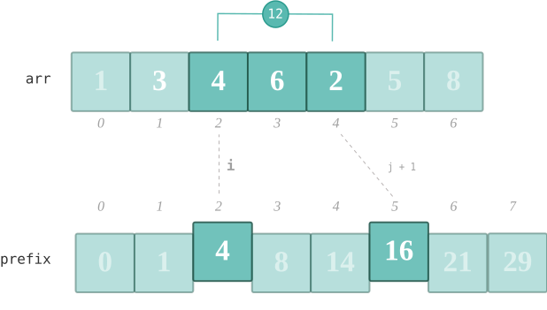

A prefix sum, or cumulative sum, is a new array where each element is the sum of all elements up to that position in the original array



```python
n = len(A)
left, prefix = 0, [0] * n
right, suffix = 0, [0] * n

for i in range(n):
    prefix[i] = prefix[i] + left
    left = left + A[i]

    suffix[~i] = suffix[~i] + right
    right = right + A[~i]
```

```python
n = len(A)
prefix = [0] * (n + 1)
for i in range(1, n + 1):
    prefix[i] = prefix[i - 1] + arr[i - 1]
```

#### Related Problems

- [560. Subarray Sum Equals K](../leetcode/560.md)
- [2574. Left and Right Sum Differences](https://leetcode.com/problems/left-and-right-sum-differences/)
